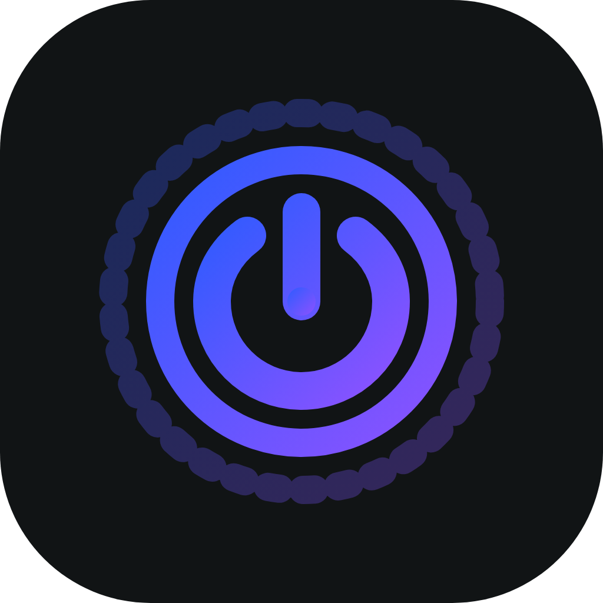
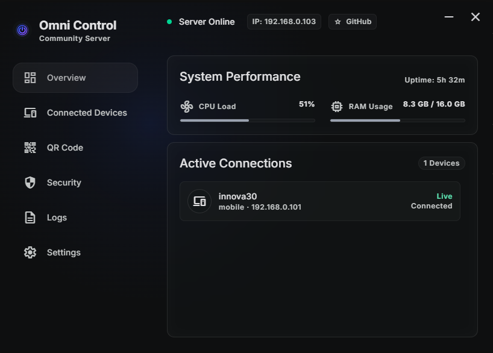
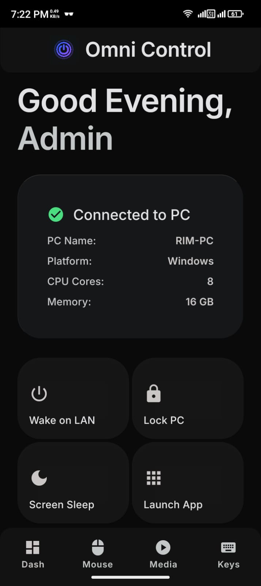

<div align="center">

<h1 align="center">
  
  Omni Control
</h1>

### Remote PC Control from Your Mobile Device

[](https://github.com/OmniControl-HQ/omni-control/actions/workflows/release.yml)
[](https://github.com/OmniControl-HQ/omni-control/releases/latest)
[](https://github.com/OmniControl-HQ/omni-control/releases)
[](LICENSE)
[](https://www.typescriptlang.org/)

Turn your phone into a wireless mouse, keyboard, and media remote

[Download](#-download) • [Features](#-features) • [Quick Start](#-quick-start) • [Documentation](#-documentation)

</div>

---

## 📸 Screenshots

<div align="center">
  <table>
    <tr>
      <td width="50%" align="center">
        
        <br/>
        <b>Desktop Dashboard</b>
        <br/>
        <sub>Real-time system monitoring and device management</sub>
      </td>
      <td width="50%" align="center">
        
        <br/>
        <b>Mobile Control</b>
        <br/>
        <sub>Intuitive touch controls at your fingertips</sub>
      </td>
    </tr>
  </table>
</div>

---

## 📥 Download

<div align="center">

### Desktop Server

| Platform    | Download                                                                                                                                                                                                                                              | Size   |
| ----------- | ----------------------------------------------------------------------------------------------------------------------------------------------------------------------------------------------------------------------------------------------------- | ------ |
| **Windows** | [Setup Installer](https://github.com/OmniControl-HQ/omni-control/releases/latest/download/Omni-Control-1.0.0-x64-Setup.exe) • [Portable](https://github.com/OmniControl-HQ/omni-control/releases/latest/download/Omni-Control-1.0.0-x64-Portable.exe) | ~76 MB |
| **macOS**   | [DMG (Apple Silicon)](https://github.com/OmniControl-HQ/omni-control/releases/latest) • [DMG (Intel)](https://github.com/OmniControl-HQ/omni-control/releases/latest)                                                                                 | ~85 MB |
| **Linux**   | [AppImage](https://github.com/OmniControl-HQ/omni-control/releases/latest) • [DEB](https://github.com/OmniControl-HQ/omni-control/releases/latest)                                                                                                    | ~90 MB |

### Mobile App

| Platform    | Download                                                              | Version     |
| ----------- | --------------------------------------------------------------------- | ----------- |
| **Android** | [APK](https://github.com/OmniControl-HQ/omni-control/releases/latest) | Coming Soon |
| **iOS**     | [TestFlight](https://testflight.apple.com)                            | Coming Soon |

> **📱 Build from source:** See [Mobile Setup](#-mobile-app-setup) for development instructions

</div>

---

## ✨ Features

### 🖱️ **Mouse & Trackpad**

- Smooth cursor movement with gesture controls
- Left, right, and middle click support
- Smooth scrolling (horizontal & vertical)
- Double-click and tap-to-click
- Adjustable sensitivity

### ⌨️ **Keyboard Control**

- Full text input with multiline support
- 15+ keyboard shortcuts (Copy, Paste, Cut, etc.)
- Function keys and special characters
- System keys (Enter, Escape, Tab, etc.)
- 5000 character input limit

### 🎵 **Media Remote**

- Play/Pause toggle
- Next/Previous track
- Volume controls (Up, Down, Mute)
- Universal media key support
- Works with any media player

### 📊 **System Monitoring**

- Real-time CPU usage tracking
- Memory utilization display
- System uptime monitoring
- Network IP address display
- Connected devices overview

### 🔒 **Security**

- PIN-based authentication (4-digit)
- Optional PIN requirement
- Connection activity logging
- IP address tracking
- Secure Socket.io communication

### 🚀 **Smart Desktop App**

- System tray integration
- Auto-start on boot (default enabled)
- Runs in background 24/7
- Low resource usage
- Cross-platform support (Windows, macOS, Linux)

---

## 🚀 Quick Start

### Desktop Setup (3 steps)

1. **Download & Install**

   ```bash
   # Download the installer for your platform
   # Windows: Run the .exe installer
   # macOS: Open the .dmg and drag to Applications
   # Linux: Make AppImage executable and run
   ```

2. **Launch the App**
   - App starts automatically in system tray
   - Double-click tray icon to open dashboard
   - Note your PC's IP address (shown in top bar)

3. **Get Your PIN**
   - Navigate to Security page
   - Your 4-digit PIN is displayed
   - Share this with your mobile device

### Mobile Setup

1. **Install & Open App**
   - Build from source or download APK
   - App opens to connection screen

2. **Connect to PC**
   - Enter your PC's IP address (e.g., `192.168.1.100`)
   - Enter the 4-digit PIN from desktop
   - Tap "Connect"

3. **Start Controlling!**
   - Use Mouse tab for cursor control
   - Use Keys tab for keyboard input
   - Use Media tab for playback control

---

## 🏗️ Architecture

```
┌─────────────────────────────────────────────────────────────┐
│                        OmniControl                           │
├──────────────────────────┬──────────────────────────────────┤
│   Desktop Server (PC)    │    Mobile App (Phone/Tablet)     │
├──────────────────────────┼──────────────────────────────────┤
│                          │                                  │
│  ┌────────────────────┐  │  ┌────────────────────┐         │
│  │  Electron + Vite   │  │  │  React Native      │         │
│  │  • Main Process    │  │  │  • Expo Framework  │         │
│  │  • React Frontend  │  │  │  • TypeScript      │         │
│  │  • System Tray     │  │  │  • Socket.io Client│         │
│  └────────────────────┘  │  └────────────────────┘         │
│           ↕              │           ↕                      │
│  ┌────────────────────┐  │  ┌────────────────────┐         │
│  │  Fastify + Socket  │←─┼──│  Touch Gestures    │         │
│  │  • REST API        │  │  │  • Trackpad        │         │
│  │  • WebSocket       │  │  │  • Keyboard        │         │
│  │  • Port 4321       │  │  │  • Media Controls  │         │
│  └────────────────────┘  │  └────────────────────┘         │
│           ↕              │                                  │
│  ┌────────────────────┐  │                                  │
│  │  System Control    │  │                                  │
│  │  • RobotJS         │  │                                  │
│  │  • Mouse/Keyboard  │  │                                  │
│  │  • Media Keys      │  │                                  │
│  └────────────────────┘  │                                  │
│                          │                                  │
└──────────────────────────┴──────────────────────────────────┘
          Local Network Connection (WiFi/Ethernet)
```

---

## 🛠️ Technology Stack

### Desktop Server

- **Framework:** Electron 31 + Vite
- **Backend:** Node.js + Fastify + Socket.io
- **Frontend:** React 19 + TypeScript + TailwindCSS 4
- **System Control:** RobotJS (native bindings)
- **Build:** electron-builder

### Mobile App

- **Framework:** React Native 0.86 + Expo 57
- **Language:** TypeScript 6
- **Routing:** Expo Router (file-based)
- **Styling:** Custom design system with glassmorphism
- **Communication:** Socket.io Client
- **Camera:** Expo Camera (QR scanning)

### Shared

- **Monorepo:** pnpm workspaces
- **Type Safety:** 100% TypeScript
- **Code Quality:** ESLint + TypeScript ESLint
- **Version Control:** Git + GitHub Actions

---

## 💻 Development Setup

### Prerequisites

```bash
# Required
Node.js >= 18.0.0
pnpm >= 9.0.0

# Optional (for mobile)
Android Studio / Xcode
```

### Installation

```bash
# Clone repository
git clone https://github.com/OmniControl-HQ/omni-control.git
cd omni-control

# Install dependencies
pnpm install
```

### Desktop App Setup

```bash
# Development mode
pnpm desktop:dev

# Production build
pnpm desktop:build

# Create installer
cd desktop-app
pnpm run build:win    # Windows
pnpm run build:mac    # macOS
pnpm run build:linux  # Linux
```

### Mobile App Setup

```bash
# Start development server
pnpm mobile:start

# Run on Android
pnpm mobile:android

# Run on iOS (macOS only)
pnpm mobile:ios

# Run in web browser (for testing)
pnpm mobile:web
```

---

## 📦 Project Structure

```
omni-control/
├── desktop-app/              # Electron desktop server
│   ├── src/
│   │   ├── main/            # Electron main process
│   │   │   ├── server/      # Fastify + Socket.io server
│   │   │   │   ├── routes/  # REST API endpoints
│   │   │   │   ├── services/# Business logic
│   │   │   │   └── socket/  # WebSocket handlers
│   │   │   └── index.ts     # App entry + system tray
│   │   ├── preload/         # Preload scripts
│   │   └── renderer/        # React frontend
│   ├── build/               # Build assets (icons)
│   └── package.json         # electron-builder config
│
├── mobile-app/              # React Native mobile client
│   ├── app/                 # Expo Router (file-based routing)
│   │   └── (tabs)/         # Tab navigation
│   │       ├── index.tsx   # Dashboard
│   │       ├── mouse.tsx   # Mouse control
│   │       ├── keys.tsx    # Keyboard control
│   │       └── media.tsx   # Media remote
│   ├── src/
│   │   ├── components/     # Reusable UI components
│   │   ├── contexts/       # React Context providers
│   │   ├── hooks/          # Custom React hooks
│   │   ├── lib/            # Utilities & socket service
│   │   ├── screens/        # Screen components
│   │   └── theme/          # Design tokens
│   └── package.json
│
├── .github/
│   └── workflows/
│       └── release.yml     # Auto-release on tag push
│
├── RELEASING.md            # Release instructions
└── package.json            # Workspace configuration
```

---

## 🔧 Configuration

### Desktop Server

Default configuration:

- **Port:** 4321
- **Host:** 0.0.0.0 (all interfaces)
- **Protocol:** WebSocket + HTTP polling fallback
- **Auto-start:** Enabled (production only)

### Mobile Client

Configurable in app:

- **Server IP:** Manual entry or QR scan
- **Connection PIN:** 4-digit authentication
- **Mouse Sensitivity:** Adjustable (0.5x - 3x)
- **Scroll Speed:** Configurable

---

## 🚀 Creating Releases

Releases are automated via GitHub Actions:

```bash
# 1. Update version
cd desktop-app
# Edit package.json: "version": "1.0.1"

# 2. Commit changes
git add .
git commit -m "chore: release v1.0.1"

# 3. Create and push tag
git tag v1.0.1
git push origin main
git push origin v1.0.1
```

GitHub Actions will automatically:

- ✅ Build for Windows, macOS, and Linux
- ✅ Create installers for all platforms
- ✅ Generate release notes
- ✅ Publish to GitHub Releases

See [RELEASING.md](RELEASING.md) for detailed instructions.

---

## 🤝 Contributing

Contributions are welcome! Please follow these steps:

1. Fork the repository
2. Create a feature branch (`git checkout -b feature/amazing-feature`)
3. Commit your changes (`git commit -m 'feat: add amazing feature'`)
4. Push to the branch (`git push origin feature/amazing-feature`)
5. Open a Pull Request

### Development Guidelines

- Follow TypeScript best practices
- Use conventional commit messages
- Maintain 100% type safety
- Test on multiple platforms before PR
- Update documentation as needed

---

## 📝 License

This project is licensed under the MIT License - see the [LICENSE](LICENSE) file for details.

---

## 🙏 Acknowledgments

- **Electron** - Cross-platform desktop framework
- **React Native** & **Expo** - Mobile development platform
- **RobotJS** - Native system control
- **Socket.io** - Real-time communication
- **TailwindCSS** - Utility-first CSS framework

---

## 📞 Support

- **Issues:** [GitHub Issues](https://github.com/OmniControl-HQ/omni-control/issues)
- **Discussions:** [GitHub Discussions](https://github.com/OmniControl-HQ/omni-control/discussions)
- **Documentation:** [Wiki](https://github.com/OmniControl-HQ/omni-control/wiki)

---

## 🗺️ Roadmap

- [x] Mouse control with smooth gestures
- [x] Keyboard input and shortcuts
- [x] Media playback control
- [x] System tray integration
- [x] Auto-start on boot
- [x] PIN-based security
- [x] Activity logging
- [x] Multi-platform builds
- [ ] Clipboard sync
- [ ] File transfer
- [ ] Multiple PC support
- [ ] Mobile app store release
- [ ] Gesture macros
- [ ] Custom shortcuts
- [ ] Dark/Light theme toggle
- [ ] Multi-language support

---

<div align="center">

**Made with ❤️ by the OmniControl Team**

[⭐ Star this repo](https://github.com/OmniControl-HQ/omni-control) • [🐛 Report Bug](https://github.com/OmniControl-HQ/omni-control/issues) • [💡 Request Feature](https://github.com/OmniControl-HQ/omni-control/issues)

</div>
